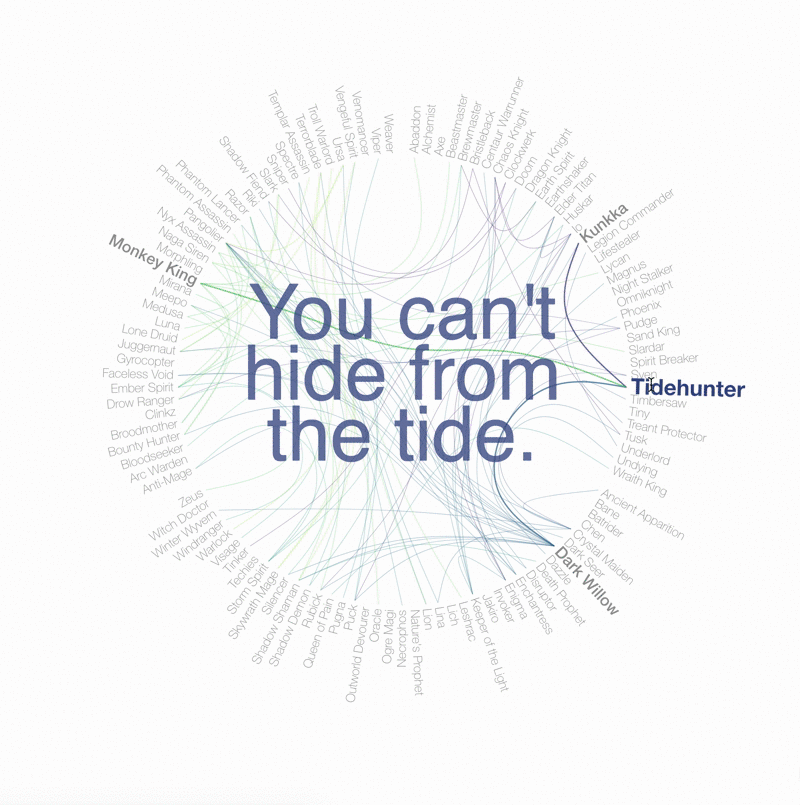

# 📖 Dota 2 Hero Lore Connectivity
Visualizing connectivity between Dota 2 hero lores

## Compile Data

### Data:
Dota 2 hero lores including associated heroes.
### Source:
Gamepedia [Dota 2 Heroes](https://dota2.gamepedia.com/Dota_2_Wiki) and respective [hero lores](https://dota2.gamepedia.com/Category:Hero_lore).
### Method:
[MediaWiki API](https://help.gamepedia.com/Bots) for Gamepedia.
### Graph:
G = {V, E} : `heroes` ↦ V, `connections_set` ↦ E

## Visualize Graph

A variation on a radial dendrogram with added adjacency highlighting using [d3v5.js](https://d3js.org/).

### [Interactive](https://beta.observablehq.com/@youmikoh/dota-2-lore-connectivity)
Powered by [ObservableHQ](https://beta.observablehq.com/)

### [Graph](https://youmikoh.github.io/dota2-lore-connectivity/)
Powered by [Github Pages](https://pages.github.com/)
